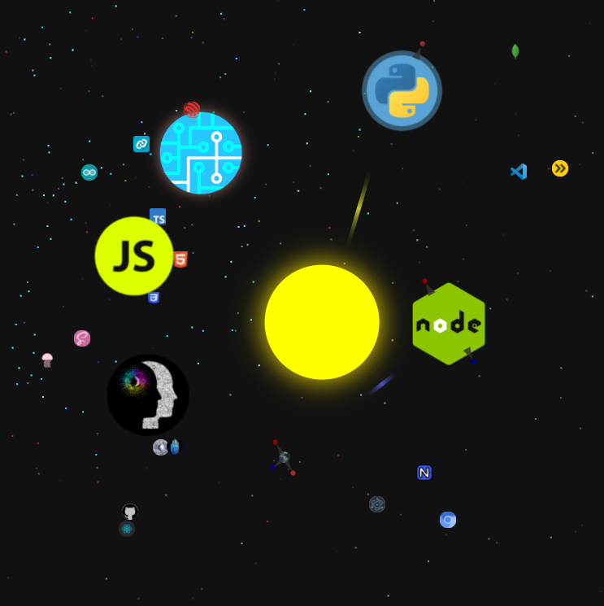

# Joshua Brewster's Portfolio 

Check out all of my progress and offerings as a developer in one interactive app! 
- [Hosted Example](http://190.92.148.106) 
- [Alt self-signed https link](https://190.92.148.106:8080/)

## Setup

Requires: Python 3.7 or later and NodeJS LTS or later. The built app size minus images is about 500kb. The build tools add about 24MB of node modules.

`npm run pip` should install any missing python packages. See [README](https://github.com/moothyknight/esbuild_base_python/blob/master/python/README.md))

`npm run dev` installs nodejs packages and runs both python and node servers concurrently (with hot reloading for FE with a persistent python streaming server backend).

You can access the Node-served page at `http://localhost:8000` or the quart server test page at `http://localhost:7000` to experiment (add `/build` at port 7000 to access the webapp build via Python (minus hot reload)). 

Set protocol to 'https' in server/server_settings.js for production and generate your ssl keys in the provided folder using the instructions. Set Production=true in python/server.py. Be sure the python server targets the ssl certs properly, too.

##### The Node --> Python socket requires https to relay messages to the browser between ports.

The node `ws` library requires ssl certs to access the python port.

## Run Concurrent Python & Node servers after setup: 

`npm run concurrent`

## Production with concurrent Python and PWA

`npm run production`

## Development Server:

`npm run dev`

then `npm run startdev` 

nodemon restarts the node server automatically when changes to included source files are detected.

The nodemon dev server adds basic frontend hot reloading via websocket and clientside code injection (see [nodeserver/server.js](https://github.com/moothyknight/esbuild_base/blob/master/node_server/server.js) for method).

> 2 dev dependencies: `nodemon` and `ws`

## Run without python:

To run: `npm run build` to bundle, then `npm start` to run the node server.

* OR `npm test` to run both commands in sequence

You can specify https and add an ssl certificate if you follow the instructions.

>2 dependencies: `esbuild` and [`fragelement`](https://github.com/brainsatplay/domelement)

## PWA build:

To test:

`npm run pwa` 

This installs workbox-cli, generates the service worker, bundles and then starts the application. Run once if you don't need to modify the service-worker further.

> 1 additional dependency: `workbox-cli`

### Other notes:

See README.md files in each folder for more explanation on how to work with these types of applications.
